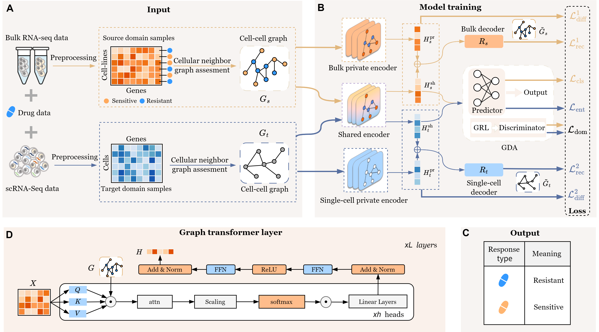

# DAGFormer

> **DAGFormer: A Graph-based Domain Adaptation Framework for Single-cell Cancer Drug Response Prediction**

## Abstract
Developing computational methods for single-cell drug response prediction deepens our understanding of tumor heterogeneity and uncovers resistance mechanisms critical to improving cancer therapy. However, current approaches struggle to fully capture intratumoral heterogeneity, as bulk RNA sequencing (bulk RNA-seq) obscures heterogeneity across individual cells, while single-cell RNA sequencing (scRNA-seq) remains constrained by limited throughput and high cost. Current approaches integrating bulk and scRNA-seq data frequently encounter batch effects, impairing robust knowledge transfer. Moreover, most existing methods overlook the role of intercellular interactions, treating cells as isolated entities. To overcome these limitations, we propose DAGFormer, a Graph-based Domain Adaptation framework that integrates bulk and scRNA-seq data for predicting single-cell drug responses. DAGFormer constructs cellular neighbor graphs using diverse topological strategies and employs Graph Domain Adaptation (GDA) to bridge graph-level distribution gaps between bulk and single-cell RNA-seq data. A dual-domain decoder further disentangles shared and modality-specific representations, preserving both general and unique biological signals. Benchmarking DAGFormer on ten independent scRNA-seq datasets demonstrated its superior performance compared to existing methods, underscoring its effectiveness and robustness in cancer drug response prediction.



## Dataset
The data folder includes different drug data.

### Source Domain Data (Bulk RNA-seq)
- **GDSC (Genomics of Drug Sensitivity in Cancer)** database.
- Drug sensitivity and resistance data with IC50 values transformed into binary labels.

### Target Domain Data (scRNA-seq)
- Contains single-cell RNA-seq data for predicting drug responses at a high resolution.

The original and preprocessed datasets can be found at:  
[Google Drive Dataset Link](https://drive.google.com/drive/folders/1y4_xWRmhIs1noyDmWz9CKL1oDWLGkO2Y?usp=drive_link)


## Requirements
- numpy>=1.24  
- scipy==1.7.3  
- scikit-learn>=1.3  
- torch-geometric==2.6.1  
- torch-scatter==2.1.2+pt24cu121  
- torch-sparse==0.6.18+pt24cu121  

## Computational environment
Experiments were conducted on a workstation equipped with one NVIDIA GeForce RTX 3090 GPU (24 GB VRAM), Intel Xeon 16-core CPU, and 128 GB RAM, running Ubuntu 22.04 LTS with CUDA 12.1 and cuDNN 8.9.
All models were implemented in Python 3.10 using PyTorch 2.4.1 (CUDA 11.8/12.1 compatible) and DGL 2.4.0+cu121.


## Training
To train DAGFormer on your dataset, you can run the following command:

```bash
python main_GT.py --cuda 0 --drug Gefitinib


